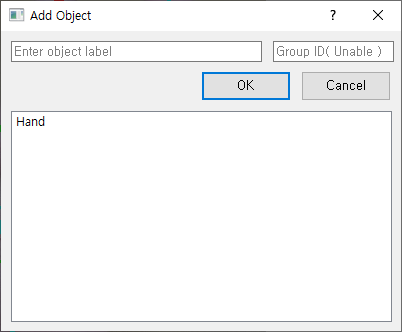

# AddObjectDialog

init( view, model ): void

#### I. Description

* 클래스 초기화 메서드
* List Widgets를 입력 받아 멤버 변수로 초기화
* Action Connect
* Dialog 내부 List Widget 초기화 메서드 호출

#### II. Input

* _**view: List\[ ObjectListWidget, LabelListWidget ]**_
* _**model: Model**_

#### III. Output

initListWidget(): void

#### I. Description

* Dialog 내 Label List 표시 위젯 초기화
* 현재 Model에 있는 Label List 목록을 Widget에 표시한다.

#### II. Input

#### III. Output

clickItem(): void

#### I. Description

* Dialog 내의 List Widget Item을 클릭하면 해당 목록의 텍스트를 Line Edit에 입력한다.

#### II. Input

#### III. Output

doubleClickItem(): void

#### I. Description

* 더블클릭 시 setLabel() 호출

#### II. Input

#### III. Output

setLabel(): void

#### I. Description

* 현재 Line Edit에 입력된 Label Name을 Model에 반영
* 중복 시 추가 입력 안함
* closeDialog() 메서드 호출

#### II. Input

#### III. Output

setObject(): void

#### I. Description

* Main Window에 있는 List Widgets에 변경사항을 반영
* Label Name, Object 추가

#### II. Input

#### III. Output

closeDialog(): void

#### I. Description

* Dialog 종료와 동시에 현재 설정된 도형의 주석 정보를 Model에 반영한다.
* setObject() 메서드를 호출

#### II. Input

#### III. Output

